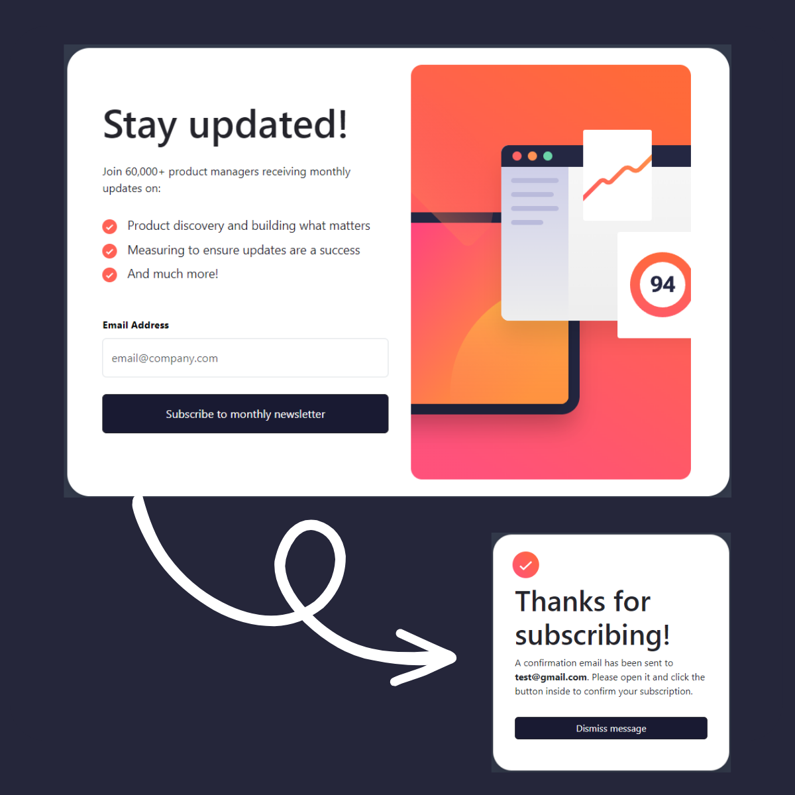

# Frontend Mentor - Newsletter sign-up form with success message ✍🏼✅

This is a solution to the [Newsletter sign-up form with success message challenge on Frontend Mentor](https://www.frontendmentor.io/challenges/newsletter-signup-form-with-success-message-3FC1AZbNrv). Frontend Mentor challenges help you improve your coding skills by building realistic projects.

## Preview image 👁

## Deployment 📦

- [DEMO](https://newsletter-sign-up-app.netlify.app/) - Website

## The Frontend Mentor Challenge

Users must be able to:

- Add their email and submit the form.
- See a success message with their email after successfully submitting the form.
- See validation messages from the form if:
  - The field is empty
  - The email address is not formatted correctly
- View the optimal interface layout based on the screen size of your device.
- View the "hover" and "focus" states of all interactive elements on the page.

## Built With 🛠️

- Frontend: React, Bootstrap, Typescript

## Frontend tools 🔜

- Bootstrap: CSS framework for styling and making the website responsive.
- Howler: Library for playing sounds in the browser.
- React: JavaScript library for building user interfaces.
- React Bootstrap: Bootstrap implementation for React. Provides ready-to-use UI components.
- React DOM: React renderer for the web.
- TypeScript: Superset of JavaScript that adds optional static typing.
- Vite: Fast development and build tool for modern web applications.

## Authors ✒️

- **Lucas Quiroga** - _Initial work_ - [Lucas Quiroga](https://github.com/Lucas-Quiroga)

## License 📄

This project is licensed © LUCAS QUIROGA 2023, all rights reserved.
